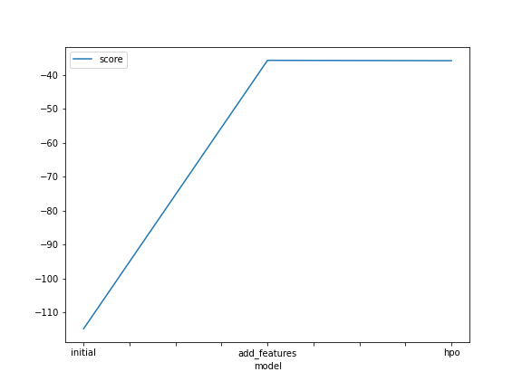
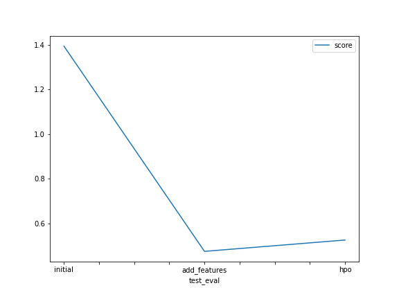

# Report: Predict Bike Sharing Demand with AutoGluon Solution
#### Htin Aung Lu

## Initial Training
### What did you realize when you tried to submit your predictions? What changes were needed to the output of the predictor to submit your results?
I just need to align, drop and add the needed columns on my first try. Alo the negative results are not accepted by **Kaggle** as this is a prediction of bike sharing count and count cannot be negative

### What was the top ranked model that performed?
The top ranked model in the raw training was **WeightedEnsemble_L3** with a RSME score of *-114.751607*.

## Exploratory data analysis and feature creation
### What did the exploratory analysis find and how did you add additional features?
For Exploratory data analysis - 
1. first I tried the given option of transforming datetime column into separate year, month, hour and weekdays columns.
2. After that ranking the weekdays as 1-6 in number.
3. And then I checked the time range in hours to see the count distribution over the time factor. And split the hours into 4 parts, *dawn, morning, evening, and night*.
4. I checked the temperature effect over count data and saw that *temperature* and *actual temperature* are in the very similar shape, so i dropped temperature column and also split the *actual temperature* into *cold, mild, and hot* based on their data average and mean.
5. And as the discription, the *season* and *weather* are category types, so I change these column's type to categories.
6. After all, I dropped the features extrected columns from both train and test dataframes as these may affect the training phase.

### How much better did your model preform after adding additional features and why do you think that is?
The Kaggle score is drastically imporved by around 60%. This is because of EDA and the machine can learn clearer based on the new features I have extracted.

## Hyper parameter tuning
### How much better did your model preform after trying different hyper parameters?
Sadly, the model performance was a little worse than normal EDA tuned training. I have no experienced on Hyperparameter tuning on Autogluon but try to do my best by reading it's document for 2 days. But the results are still not improved by hyperparameter tuning. Also I increase the training time to 15 minutes to improve the result.

### If you were given more time with this dataset, where do you think you would spend more time?
I will try a little more on EDA and much more on understanding Autogluon's hyperparameter documentation to imporve my model's score.

### Create a table with the models you ran, the hyperparameters modified, and the kaggle score.
|model|hpo1|hpo2|hpo3|score|
|--|--|--|--|--|
|initial|default|default|default|1.39358|
|add_features|default|default|default|0.47606|
|hpo|GBM extra tree|GBM large|AG Text NN Medium quality faster train|0.52675|

I can't proparly add to this table because I can't find how to do HPO efficiently.
 I found the model names and the keys are needed. but I don't know how the keys work. So in the last hyperparameter model, I just tried with hyperparameter config library from Autogluon and set this as hyperparameter for my model with 
 >'GBM': [{},
  {'extra_trees': True, 'ag_args': {'name_suffix': 'XT'}},
  'GBMLarge']
  <
  
  and
  
  >'AG_TEXT_NN': ['medium_quality_faster_train'] <
### Create a line plot showing the top model score for the three (or more) training runs during the project.

TODO: Replace the image below with your own.

### Create a line plot showing the top kaggle score for the three (or more) prediction submissions during the project.

TODO: Replace the image below with your own.

## Summary
To summerize my report, this is always the best idea to do proper EDA on the data first because this can drastically increase the result. Hyperparameter tuning and optimization may work better if we have knowledge on most of the ML model's behaviours. I need to learn more about hyperparameters. Thank You.
